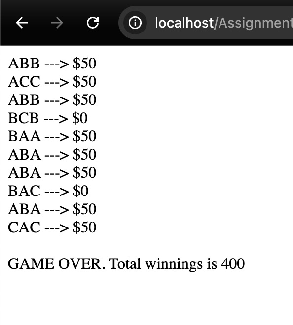

# Project Title
- Creating a PHP Slot Game
- Name: Elizabeth Sherwood
- Due: Monday, 9/8/2025 at 8AM
- Finally Finished Correctly: 9/17/2025

## Description
- Slots Program: Develop a simple slot game using PHP that incorporates arrays, the match() expression, loops, and logical conditions.

## Requirements
- PHP installed (version 8)
- Local server (XAMPP, MAMP etc,)
- Web browser

## Installation
1. Clone or download the repository.
2. Place the project folder into your server’s web root (e.g., `htdocs/` for XAMPP).
3. Start the server.

## Repo
[ShErWooD-ForEsd](https://github.com/ShErWooD-ForEsd/slots)

## Screenshot of homepage
